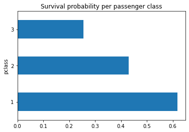
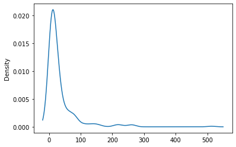

# CLASSIFICATION ON TITANIC DATA 

## Table of contents :
0. [Context](#0)
1. [Data Analysis](#1)
    1. [Confusion matrix](#1-a)
    2. [Gender Distribution](#1-b)
    3. [Passenger class survive probabilty](#1-c)
2. [Data Transformation](#2)
    1. [Fare before transformation](#2-a)
    2. [Fare after transformation](#2-b)
3. [Modeling](#3)
    1. [Model selection](#3-a)
    2. [Final model ](#3-b)
 4. [What could be explored more ?](#4)

## CONTEXT : 

- This is one of the first machine learning projects I did during my studies.

- The Titanic competition is a well-known challenge in the field of data science, which consists of **predicting the probability that a person will or will not survive** the impact of the famous ship against an iceberg on 14 April 1912.
- **Here is the data dictionary of the  dataset**:

| Variable |                 Definition                 |                       Key                      |
|:--------:|:------------------------------------------:|:----------------------------------------------:|
| survival | Survival                                   | 0 = No, 1 = Yes                                |
| pclass   | Ticket class                               | 1 = 1st, 2 = 2nd, 3 = 3rd                      |
| sex      | Sex                                        |                                                |
| Age      | Age in years                               |                                                |
| sibsp    | # of siblings / spouses aboard the Titanic |                                                |
| parch    | # of parents / children aboard the Titanic |                                                |
| ticket   | Ticket number                              |                                                |
| fare     | Passenger fare                             |                                                |
| cabin    | Cabin number                               |                                                |
| embarked | Port of Embarkation                        | C = Cherbourg, Q = Queenstown, S = Southampton |

- I managed to get a final score of 81% accuracy using the support vector model
- All the code I made is documented with comments to understand my approach throughout the project. I have added to this read the most interesting tracks of my work:
    
## 1) Data Analysis 
### a) Confusion matrix 

*Correlation matrix of the variables. "survived" variable is the dependent one*

- From the correlation matrix, we can notice that the most correlated variables to survival is the gender, the fare and class de la personnes, lets take a closer look in this variables to try to understand why.

### b) Gender Distribution 

- As we can see 80.9% of  women survived against 27.3% of men. This is because women and children were given priority to board the lifeboats

### c) Passenger class survive probabilty 

Here we can see that the probability of survival is higher if the passenger is in a upper class, this is due to the fact that the upper class areas on the titanic are naturally less crowded, so there is less crowding and more safety boats available to 1st and 2nd class passengers.

## 2) Data Transformation 
### a) Fare before transformation 

*Distribution of the fare variable*

Concerning the fare variable, well as the graph above shows, we have a right skewed dsitribrution of prices paid by passengers.

### b) Fare after transformation 

To improve the correlation of this variable with our dependent variable, I used the lograthmic scale which gives us the following distribution: 

*Distribution of the fare variable after performing a log scale transformation*

This increased the correlation between fare (with log) and survied category. (0.24 -> 0.31)

## 3) Modeling 
### a) Model selection 

*Train accuracy, test accuracy, cross validation mean accuracy for each model tested*

- After putting to the test several ML algorithms we found some **overfitting problem** : Huge difference bewteen the accuracy of the training and testing phase for the following methods: 
- RandomForest
- DecisionTree
- KNeighboors
- Catboost

- After some trials to reduce de max depth and pruning on tree-bases models, we finally decided to choose the Support Vecotor Classifier, wichi has the best performance and remains stable.

### b) Final model 
Finally we performed a finetuing process on SV classifier and came up with a final accuracy of 81%.

 *Confusion matrix of the final model*

 ## 4)  What could be explored more ? 

- Try to do more feature engenieering, to come up with more correlated data
- test other ML algorithms (XGBoost, MLP)
- Fine tune all the tested algorithms
- Try to use SMOTE to have a 50/50 repartition of the values (regarding the dependent variable)